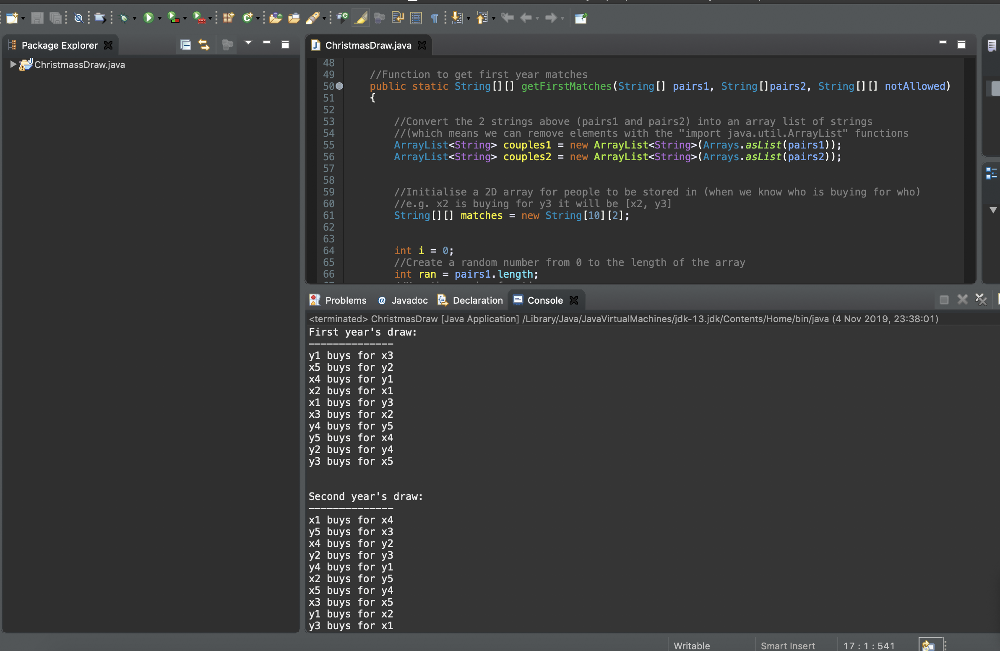

# Secret Santa

# Program
This is an implementation of "Secret Santa" gift giving. Secret Santa is where a group of poeple decides that instead of buying many cheap presents, each person will buy for only one other person in the group and get a more expensive present. That means you will get one present and will buy one present (for everyone in the group).

This implementation also considers couples (meaning couples e.g. x1 and y1 annot buy for each other) and will generate 2 years of present giving (also making sure that draws from year 1 do not repeat over to year 2 e.g. if x3 buys for y1 in year 1 this will not happen again in year 2).
